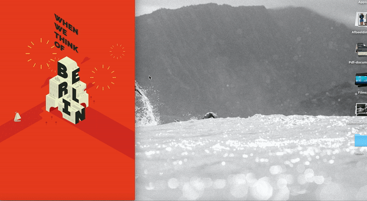
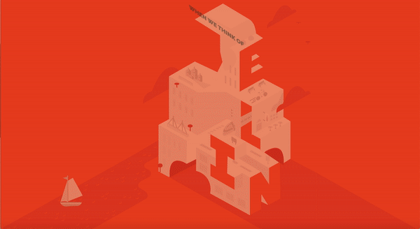

# `De opdracht`
De gekregen opdracht is: maak een css / html / js versie van een gekozen kunstwerk uit een archief. Maak met gebruik van css leuke animaties om het kunstwerk minder statisch te maken. 

# `When we think of Berlin`

When we think of Berlin is een illustratie gemaakt door Herb Lestr, voor een city guide met allerlei informatie over Berlijn. Het idee achter de city guide was dat een aantal mensen allerlei markten, parken, mooie stations, musea, goeie koffie tentjes en meer hadden genoteerd waar zij als eerste aan dachten als zij Berlijn hoorden. 

Ik heb dit kunstwerk gekozen omdat er veel detail in zit, en ik meteen al leuke dingetjes zag om te animeren en het werk tot leven te brengen. 

>Artwork by: Herb Lester
>Year published: 2011
>Made for: city guide's

# `Workflow`
 Ik ben begonnen met het namaken van mijn kunstwerk in illustrator, ik heb hier nog wat elementen aan toegevoegd zoals het bootje. Het kostte nogal wat tijd omdat alles met de pen tool overgetrokken moest worden (helaas de trace pakte het werk niet) maar dat was het waard! Vervolgens heb ik het geëxporteerd als SVG en geopend in Sublime om zo verder te gaan werken met code. 

# `Responsive`
Tijdens het responsive maken van mijn kunstwerk kwam ik er achter dat ik een ontwerp fout had gemaakt. Mijn kunstwerk schaalt mee zoals ik wil, alleen is het dan erg klein op mobile. Ik dacht dat er een mogelijkheid was om het kunstwerk gewoon te vergroten, maar dan krijg je dat je heel ver naar links en rechts kan scrollen wat niet de bedoeling is. Sommige animaties zijn nu erg klein, maar dat heb ik geprobeerd om op te lossen met een button. 

# `Interacties & animaties`
* Vuurwerk (keypress)
* Vliegtuig (keypress)
* Beweging in het gebouw (hover)
* Bootje en wolkjes
* Fade in en boompjes

<B>Vuurwerk en vliegtuig</B>
Ik had wel eens eerder met een keypress gebruikt bij frontend voor designers, maar het was toch een beetje weggevallen. Dus dat was even opnieuw uitzoeken maar het is uit eindelijk gelukt! Als je arrow up indrukt komt het vuurwerk tevoorschijn door middel van een stukje script die een "class hidden" en een "class show" toggled. Hetzelfde geldt als je de v indrukt, alleen komt er dan een vliegtuigje tevoorschijn

>Vliegtuig: heb ik genanimeerd aan de hand van een <animateMotion> tag. Deze was wel nieuw voor mij! Maar na wat gegoogle snapte ik wat de bedoeling er van was en dat deze juist perfect is voor svg animaties. Ik heb een lijn illustratie gemaakt en aangegeven dat mijn andere illustratie deze moet volgen, en deze vervolgens in javascript met keypress geactiveerd. 
>Vuurwerk: aan de hand van keyframes en wat youtube tutorials is het gelukt om een vuurwerk effect te creeëren! Ik heb alle classes gestyled door middel van een nth-type selector en door middel van javascript de keypress geactiveerd. 

<B>Beweging in het gebouw</B>
Door middel van een hover wilde ik verschillende elementen laten bewegen. Door de transform optie heb ik de trein uit de tunnel laten schuiven, en verschuift de fiets naar rechts. Ik had eerst geprobeerd om de fiets een salto te laten maken, alleen met hover moet je dan steeds je fiets volgen en dat gaat lastig, dus heb ik deze ook vervangen voor een schuif optie. Ik heb ook geprobeerd om de svg letters neon te laten knipperen, alleen werkt de text-shadow property niet op een svg dus heb ik deze toegepast op de h1 op het gebouw. 

>Trein & Fiets: door middel van een transform: translate(x); heb ik de objecten laten bewegen.
>Knippertekst: door keyframes heb ik een blink animatie gemaakt, die start als je over de tekst heen hovert. Met een text-transform heb ik de tekst schuingekregen. 

<B>Bootje en wolkjes</B>
Ik wilde bij mijn kunstwerk een aantal elementen die standaard geanimeerd zouden bewegen. Ik heb gekozen om dat te doen met de wolkjes en het bootje. Deze zijn namelijk subtiel maar vallen toch op.

>Boot: de boot heb ik laten deinsen door het te verstoppen achter een soort golf, deze heb ik gemaakt in illustrator en voor de boot gepositioneerd. De boot zelf doet niks meer dan  transform: rotate(1deg) translate(-15px);
>Wolkjes: de wolkjes heb ik laten 'bouncen' door middel van een 65%  { transform: translate(0, 15px); } en een ease erop. 

<B>Fade in en boompjes</B>
Ik wilde ook dat als je de website opend het kunstwerk tevoorschijn komt, zodat het iets minder 'bam in your face' is. Daarbij heb ik de boompjes ook laten in springen zodat het voelt alsof deze van boven komen vallen. 

>Fade: ik heb heel simpel een keyframe animatie gemaakt waarvan de opacity van 0 naar 1 gaat, en dan met een ease om het te verzachten.
>Boompjes: de boompjes heb ik met een transform; scaleY animatie gemaakt. De boom begint op 0, verspringt naar 1 en dan nog heel even terug naar 0.9 om het dat bounce effect te geven. 

# `Bronnen`
Hierbij mijn lijst aan gebruikte bronnen:

* https://codepen.io/dmaristem/pen/RLeXXK
* https://css-tricks.com/snippets/css/a-guide-to-flexbox/
* https://developer.mozilla.org/en-US/docs/Web/API/KeyboardEvent/keyCode#Browser_compatibility
* https://developer.mozilla.org/en-US/docs/Web/CSS/transform
* https://www.youtube.com/watch?v=K4K7HNavK4U
* https://www.youtube.com/watch?v=BDO_xNCw6wU
* https://developer.mozilla.org/en-US/docs/Web/SVG/Element/animateMotion
* https://css-irl.info/fun-with-css-motion-path/

